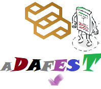

## ADAFEST: A data-driven apparatus for estimating software testability

## Manifesto

Connecting runtime information to the static properties of the program is a key point in measuring software quality, including testability. Despite a large number of researches on software testability, we observed that the relationship between testability and test adequacy criteria had not been studied, and testability metrics still are far from measuring the actual testing effort. We hypothesize that testability has a significant impact on automatic testing tools. Therefore, we propose a new methodology to measure and quantify software testability by exploiting both runtime information and static properties of the source code.

## Getting started
To train and evaluate different testability predictions:

1. Install prerequisite packgaes including `scikit-learn`, `pandas`, and `joblib`.
2. Create a directory with the name `results` beside the ‘data’ directory in the `adafest` package.
3. Run `main.py` script in the `adafest.code` package. 
4. Wait to finish the training and evaluation.

**Note1:** The `main.py` script in the `adafest.code` package, train and test five regression model including ‘DTR’, ‘RFR’, ‘HGBR’, ‘MLPR’, and ‘VoR’ in six datasets available on the `data` directory.

**Note2:** The execution time of this script depends on the computational power of the system used to train the model. On the Code Ocean platform, it takes bout one hour. 

**Note3:** The trained models, the results of model selection (through grid-search with cross-validation), and the result of the models’ tests (including different evaluation metrics) are saved into the `results` directory. 

## Repository structure

### Source codes

* `adafest` main package contains the following structure:

* `code.experiment`: Including scripts used to analyze the datasets and models to answer specific research questions discussed in the published papers. The script can be used to reproduce the reported tables and plots in the published papers. However, at this time, the scripts have not been described with comments. Opening an issue or a discussion about that would be welcomed.

* `code.metric`: The scripts are related to extracting source code metrics (including object-oriented metrics, sub-metrics, lexical metrics, and package-level metrics) using the Understand API. At this time, the scripts have not been described with comments. Opening an issue or a discussion about that would be welcomed.

* `code.preporcessing`: The scripts used to preprocess the extracted metrics to prepare datasets for training prediction models. At this time, the scripts have not been described with comments. Opening an issue or a discussion about that would be welcomed.

* `code.testability`: Including scripts that implement model selection, training, testing, and inference for Coverageability and Testability measures proposed in this research bundle. 

### Datasets
* `data`: Including the dataset used to train and test the testability prediction models.

* `dataset06`: Including the used to train and test the Coverageability prediction models.

Datasets are also available on the following platforms:

[1] Mendeley Data: 
[https://data.mendeley.com/datasets/mg5nvs9rsg/1](https://data.mendeley.com/datasets/mg5nvs9rsg/1)

[2] Zenodo:
[https://zenodo.org/record/4650228](https://zenodo.org/record/4650228)

## News
**August 15, 2022:** ADAFEST Executable Compute Capsule was published on Code Ocean platform: 
[https://codeocean.com/capsule/7939508/tree/v1](https://codeocean.com/capsule/7939508/tree/v1)

**August 13, 2022:** Initial version of full source code was released. 

**July 26, 2022:** We are planning to release ADAFEST full version on September 2022.

**April 6, 2022:** Some parts of code relating to metrics computation was released.

**October 6, 2020:** The ADAFEST repo was created.
The full version of source code will be available as soon as the relevant paper(s) are published.

## Publications

[1] Zakeri-Nasrabadi, M., & Parsa, S. (2021). Learning to predict software testability. 2021 26th International Computer Conference, Computer Society of Iran (CSICC), 1–5. [https://doi.org/10.1109/CSICC52343.2021.9420548](https://doi.org/10.1109/CSICC52343.2021.9420548)

[2] Zakeri‐Nasrabadi, M., & Parsa, S. (2021). Learning to predict test effectiveness. International Journal of Intelligent Systems. [https://doi.org/10.1002/int.22722](https://doi.org/10.1002/int.22722)

[3] Zakeri‐Nasrabadi, M., & Parsa, S. (2022). An ensemble meta-estimator to predict source code testability. Applied Soft Computing. [https://doi.org/10.1016/j.asoc.2022.109562](https://doi.org/10.1016/j.asoc.2022.109562) 

Free access: 
[https://authors.elsevier.com/c/1fgY65aecSnjlt](https://authors.elsevier.com/c/1fgY65aecSnjlt)

## Cite this repository and dataset

### Cite dataset
Zakeri-Nasrabadi, Morteza; Parsa, Saeed (2022), “Testability prediction dataset”, Mendeley Data, V1, doi: 10.17632/mg5nvs9rsg.1

### Cite tool
Zakeri-Nasrabadi, M. (2022). ADAFEST: A data-driven apparatus for estimating software testability (Version 0.1.0) [Computer software]. https://doi.org/https://doi.org/10.5281/zenodo.6683950

## Read more
Visit the project website at [https://m-zakeri.github.io/ADAFEST](https://m-zakeri.github.io/ADAFEST).

Feel free to e-mail and ask any question: `m-zakeri[at]live[dot]com`.
